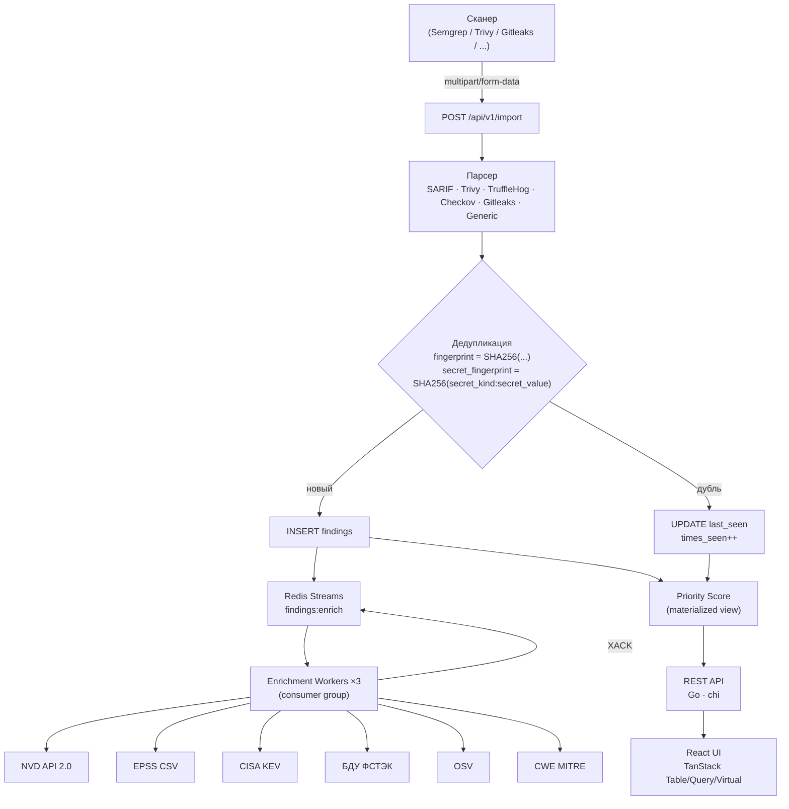

# Архитектура RedLycoris

## Поток данных



## Компоненты

### Backend (Go 1.24)

| Пакет | Назначение |
|-------|------------|
| `cmd/server` | Точка входа: конфиг, миграции, graceful shutdown |
| `internal/api` | Chi-роутер, хендлеры, middleware |
| `internal/domain` | Структуры данных, бизнес-логика (scoring, dedup) |
| `internal/storage` | SQL-запросы через pgx/v5 (без ORM) |
| `internal/parser` | Парсеры форматов сканеров |
| `internal/enrichment` | Redis Streams workers, планировщик синхронизации |
| `internal/observability` | /healthz, /readyz, /metrics (Prometheus) |
| `internal/audit` | Audit log writer + партиционирование |
| `internal/version` | Build-time версионирование через ldflags |

### Хранилище

**PostgreSQL 16** — основная БД:
- `findings` — партиционирована по `imported_at` (RANGE, помесячно)
- `finding_enrichments` — результаты обогащения (JSONB)
- `finding_scores` — priority scores
- `sync_status` — состояние источников обогащения
- `audit_log` — аудит изменений (партиции по месяцам)
- Materialized view `finding_priority` — обновляется каждые 5 мин

**Redis 7** — кэш + очереди:
- Stream `findings:enrich` — задачи обогащения
- Consumer group `enrichment-workers` — три воркера с балансировкой
- Rate limiting — `ratelimit:login:{ip}:{email}`

### Frontend (React 18 + TypeScript)

| Библиотека | Использование |
|------------|---------------|
| TanStack Query | Серверный стейт, кэширование |
| TanStack Table | Таблица findings с сортировкой/фильтрацией |
| TanStack Virtual | Виртуализация длинных списков |
| Zustand | Клиентский стейт (фильтры, UI) |
| shadcn/ui | Компоненты (Button, Badge, Dialog, ...) |
| Tailwind CSS | Стилизация |
| React Router v6 | Маршрутизация |

## Пагинация

Cursor-based пагинация на всех списочных endpoint'ах:

```
GET /api/v1/findings?limit=50&cursor=eyJpZCI6...&sort=-priority_score
```

Курсор = base64(JSON{id, sort_field_value}). Без OFFSET, стабильно при параллельных вставках.

## Обогащение — жизненный цикл сообщения

```
Import → INSERT finding
       → XADD findings:enrich {finding_id, source_types}
       
Worker → XREADGROUP (block 5s)
       → обработка (HTTP запрос к источнику, INSERT enrichment)
       → XACK  ← только при успехе
       
При перезапуске:
       → processPending() — XPENDING + XCLAIM просроченных
```

## Graceful Shutdown

```
SIGTERM
  → HTTP server.Shutdown(ctx, 15s)   # дожидается активных запросов
  → auditWriter.Close(ctx, 15s)      # сбрасывает буфер аудита
  → context.cancel()                 # останавливает enrichment workers
    (workers завершают текущее сообщение + XACK, затем выходят)
  → pool.Close()                     # pgxpool закрывается последним
```
