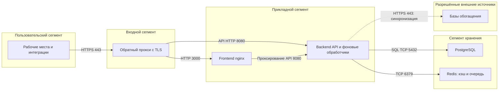

# Администратор-Безопасная-сетевая-конфигурация

Корневой production overlay не является готовой защищённой сетевой конфигурацией. Он удаляет публикацию PostgreSQL и Redis, но оставляет HTTP-порты backend и frontend. Backend запускается через `ListenAndServe`, nginx поставки слушает `3000` без TLS.

## Сегментация

Схема показывает целевой вариант с внешним TLS-прокси. Прокси и границы сегментов организуются администратором: отдельные сегменты и правила межсетевого экрана не создаются штатным Compose.



Маршрут через frontend показан потому, что его nginx умеет проксировать `/api/`; внешний прокси может направлять `/api/` непосредственно в backend. Не публикуйте служебные проверки и метрики как часть пользовательского API.

| Соединение | Разрешение в целевом контуре |
| --- | --- |
| Пользователи → TLS-прокси | HTTPS к согласованному имени |
| TLS-прокси → frontend/backend | Только нужные внутренние HTTP-порты |
| Backend → PostgreSQL/Redis | Только внутренний доступ; без публикации хранилищ на узле |
| Система мониторинга → backend | `/healthz`, `/readyz`, `/health`, `/metrics` через доверенный внутренний маршрут |
| Backend → интернет | Только адреса из [списка источников](Администратор-Работа-в-закрытом-контуре) либо полный запрет |

## TLS и публикация портов

Ниже приведён пример локальной конфигурации узла, а не файл из поставки. Он предполагает TLS-прокси на том же узле и доверенное локальное окружение. Для прокси на другом узле вместо loopback требуется отдельная адресация и сетевые правила.

1. Создайте локальный `docker-compose.security.yml` в редакторе. Замените имя `redlycoris.example.org` своим именем:

   ```yaml
   services:
     backend:
       ports: !override
         - "127.0.0.1:8080:8080"
       environment:
         ENV: production
         COOKIE_SECURE: "true"
         CORS_ORIGINS: "https://redlycoris.example.org"
         TRUST_PROXY: "true"
         BDU_INSECURE_SKIP_VERIFY: "false"
     frontend:
       ports: !override
         - "127.0.0.1:3000:3000"
   ```

   Этот файл применяется после базового файла и корневого production overlay, который закрывает порты хранилищ. `!override` заменяет весь список публикаций, не добавляя новые привязки к старым. Для этого синтаксиса требуется Compose с поддержкой `!override` — в [справочнике объединения](https://docs.docker.com/reference/compose-file/merge/) указана версия 2.24.4 и новее. Это требование примера, а не установленная минимальная версия всего продукта.

2. На доверенном прокси настройте сертификат, закрытый ключ и маршруты. Следующий фрагмент включается в конфигурацию nginx узла; пути к сертификатам являются примером:

   ```nginx
   server {
       listen 443 ssl;
       server_name redlycoris.example.org;
       ssl_certificate /etc/nginx/tls/redlycoris-chain.pem;
       ssl_certificate_key /etc/nginx/tls/redlycoris-key.pem;

       location /api/ {
           proxy_pass http://127.0.0.1:8080;
           proxy_set_header Host $host;
           proxy_set_header X-Forwarded-For $remote_addr;
       }
       location ~ ^/(healthz|readyz|health|metrics)$ {
           return 404;
       }
       location / {
           proxy_pass http://127.0.0.1:3000;
           proxy_set_header Host $host;
           proxy_set_header X-Forwarded-For $remote_addr;
       }
   }
   ```

   Согласуйте размер разрешённого запроса и таймауты прокси с используемыми операциями импорта и экспорта. Выпуск сертификата и обслуживание ключа не реализованы в поставке. Синтаксис приведён по справочникам nginx: [TLS](https://nginx.org/en/docs/http/ngx_http_ssl_module.html), [проксирование и заголовки](https://nginx.org/en/docs/http/ngx_http_proxy_module.html).

3. Проверьте конфигурацию до применения:

   ```bash
   docker compose -f docker-compose.yml -f docker-compose.prod.yml -f docker-compose.security.yml config --quiet
   sudo nginx -t
   ```

4. В согласованное окно пересоздайте приложение и примените конфигурацию прокси. Операция прерывает текущие запросы и фоновые задачи:

   ```bash
   docker compose -f docker-compose.yml -f docker-compose.prod.yml -f docker-compose.security.yml up -d --no-build
   sudo nginx -s reload
   ```

Проверка результата: обе проверки конфигурации завершаются без ошибок. `docker inspect redlycoris-backend --format '{{json .HostConfig.PortBindings}}'` и аналогичная команда для frontend показывают только `127.0.0.1`. Для `redlycoris-postgres` и `redlycoris-redis` нет опубликованных портов. По внешнему HTTPS-адресу доступна страница входа, а `GET /api/v1/version` возвращает JSON; сертификат проходит проверку без `curl -k`.

## COOKIE_SECURE и CORS_ORIGINS

`COOKIE_SECURE=true` устанавливает флаг Secure у `rl_session`. Также код задаёт `HttpOnly`, `SameSite=Lax`, `Path=/`, без явного Domain. При включении Secure доступ по обычному HTTP не является корректной проверкой входа.

CORS сравнивает `Origin` с точными строками списка после удаления краевых пробелов. Значение `*` не реализует разрешение всех origin. Для origin вне списка обработчик просто не добавляет `Access-Control-Allow-Origin`: это не серверная авторизация и не сетевой запрет. Даже такой OPTIONS-запрос получает `204`. Не используйте CORS вместо ограничения доступа к backend.

### Проверка браузерного доступа

1. Выполните запросы к своему адресу:

   ```bash
   curl -sS -D - -o /dev/null -X OPTIONS https://redlycoris.example.org/api/v1/auth/login -H 'Origin: https://redlycoris.example.org' -H 'Access-Control-Request-Method: POST'
   curl -sS -D - -o /dev/null -X OPTIONS https://redlycoris.example.org/api/v1/auth/login -H 'Origin: https://untrusted.example.org' -H 'Access-Control-Request-Method: POST'
   ```

2. Войдите через браузер и проверьте атрибуты cookie, не копируя её значение.

Проверка результата: первый ответ содержит точный разрешённый origin и `Access-Control-Allow-Credentials: true`, второй не содержит `Access-Control-Allow-Origin`. Cookie `rl_session` имеет Secure и HttpOnly; после обновления страницы сессия сохраняется.

## TRUST_PROXY и X-Forwarded-For

При `TRUST_PROXY=false` адрес берётся из `RemoteAddr`. При `true` используется первый непустой элемент `X-Forwarded-For`: код не проверяет IP отправителя по списку доверенных прокси и не проверяет формат первого элемента.

Непроверенный заголовок позволяет подменять адрес для ключа ограничения входов, записи IP сессии и операций, использующих `extractIP`. Если backend доступен напрямую либо входной прокси дописывает адрес к переданному клиентом списку, первый элемент может контролировать клиент. Поэтому пример выше заменяет заголовок на `$remote_addr`, а не использует `$proxy_add_x_forwarded_for` на недоверенной границе. Для нескольких прокси отдельно определите, какой узел очищает заголовок и какие узлы могут обращаться к backend.

### Проверка границы доверия

1. С другого узла проверьте недоступность прямых портов API, frontend, PostgreSQL и Redis средствами сетевого контроля организации. С узла установки проверьте опубликованные привязки командами `docker inspect`, указанными выше.
2. Просмотрите фактически загруженную конфигурацию прокси командой `sudo nginx -T`: на внешней границе заголовок должен заменяться, а не сохраняться из запроса клиента. Не публикуйте полный вывод конфигурации.

Проверка результата: внешние клиенты достигают приложения только через TLS-прокси; все пути, ведущие к backend, проходят доверенную обработку заголовка. Если это не обеспечено, оставьте `TRUST_PROXY=false` и учитывайте общий адрес прокси при диагностике ограничения входов.

## Чек-лист перед публикацией

- [ ] Порты PostgreSQL и Redis не опубликованы; прямой доступ к API и frontend ограничен.
- [ ] Сертификат соответствует имени; ключ доступен только обслуживающим прокси субъектам.
- [ ] `ENV=production`, `COOKIE_SECURE=true` действительно переданы контейнеру.
- [ ] CORS содержит точный origin; проверены разрешённый и посторонний origin.
- [ ] При `TRUST_PROXY=true` исключён обход прокси и подмена первого элемента X-Forwarded-For.
- [ ] Служебные проверки и метрики доступны только мониторингу и администраторам.
- [ ] Первоначальные пароли заменены; смена bootstrap-пароля проверена вручную.
- [ ] Если включён БДУ, явно задано `BDU_INSECURE_SKIP_VERIFY=false` и проверена синхронизация.
- [ ] Проверены [резервная копия](Администратор-Резервное-копирование) и [восстановление](Администратор-Восстановление).

## Источники реализации

[https://github.com/Nefrit0n/Red-Lycoris/blob/main/backend/internal/api/auth.go](https://github.com/Nefrit0n/Red-Lycoris/blob/main/backend/internal/api/auth.go)

[https://github.com/Nefrit0n/Red-Lycoris/blob/main/backend/internal/api/middleware.go](https://github.com/Nefrit0n/Red-Lycoris/blob/main/backend/internal/api/middleware.go)

[https://github.com/Nefrit0n/Red-Lycoris/blob/main/backend/internal/api/router.go](https://github.com/Nefrit0n/Red-Lycoris/blob/main/backend/internal/api/router.go)

[https://github.com/Nefrit0n/Red-Lycoris/blob/main/frontend/nginx/default.conf](https://github.com/Nefrit0n/Red-Lycoris/blob/main/frontend/nginx/default.conf)

[https://github.com/Nefrit0n/Red-Lycoris/blob/main/docker-compose.prod.yml](https://github.com/Nefrit0n/Red-Lycoris/blob/main/docker-compose.prod.yml)
