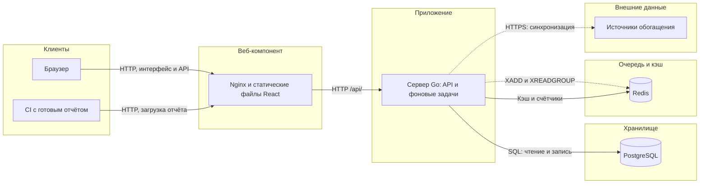

# Система-Архитектура

Red Lycoris принимает готовые отчёты сканеров, преобразует их в находки, дедуплицирует и дополняет сведениями из локальных копий баз обогащения. Запуск сканеров остаётся за пределами платформы. Наличие параметров репозитория и `autoscan_on_push` в проекте не означает, что сервер выполняет сканирование.

## Компоненты

Сервер представляет собой одно приложение Go: HTTP API, обработчики очереди, планировщик синхронизаций и обслуживание БД работают в одном процессе. Это не набор независимо развёртываемых микросервисов.

| Компонент | Ответственность | Граница |
|---|---|---|
| Веб-интерфейс React | Представление проектов и находок, фильтры, триаж, импорт, административные страницы | Проверки интерфейса не заменяют авторизацию API |
| Nginx в производственной сборке интерфейса | Раздача статических файлов и проксирование `/api/` к серверу | Поставляемый конфиг использует HTTP, не завершает TLS |
| Сервер Go | Авторизация, парсинг, SQL-операции, обогащение, аудит | Фоновые задачи используют ресурсы того же процесса и пула БД, что и HTTP |
| PostgreSQL | Находки, оценки, справочники обогащения, проекты, доступ, сессии и аудит | Основное постоянное хранилище |
| Redis | Redis Stream обогащения, кэш, ограничение попыток входа | Очередь не включена в транзакцию PostgreSQL |
| Внешние источники | Публикация данных NVD, EPSS, KEV, БДУ, OSV, CWE и CPE | Доступны планировщику; обработчик отдельной находки читает локальные таблицы |

Схема показывает путь через Nginx, а не обязательную топологию доступа: корневой Compose также публикует порт API. TLS и ограничение прямого доступа к серверу описаны в [безопасной сетевой конфигурации](Администратор-Безопасная-сетевая-конфигурация). При разработке вместо Nginx может использоваться стадия `development` с Vite.

## Поток данных

Детектор последовательно проверяет зарегистрированные парсеры и выбирает первый подходящий. Парсер возвращает массив `domain.Finding`; для категории `other` детектор может уточнить категорию по содержимому и пересчитать fingerprint. После этого обработчик назначает проект и сохраняет находки.

| Этап | Ручной импорт `POST /api/v1/import` | CI-загрузка `POST /api/v1/scans` |
|---|---|---|
| Аутентификация | Пользовательская сессия; для проекта требуется не ниже `triager`, глобальный администратор имеет обход проверки роли | Проектный PAT со scope `scans:write`; пользовательской сессии недостаточно |
| Проект | Параметр `project_id` имеет приоритет над данными отчёта | Только проект токена; query-параметр `project_id` игнорируется |
| Разбор | Тело отчёта считывается в память, затем разбирается целиком | Файл `report` из multipart считывается в память, затем разбирается целиком |
| Сохранение | Отдельная запись каждой находки; ошибки собираются по элементам, возможен частичный результат | Одна транзакция для `scans`, находок и `finding_scan_links` |
| Повторные находки | Обновляются по fingerprint; создаётся событие `seen_again` с ограничением одного события в сутки UTC | Связываются со сканом; повторное обнаружение учитывается в счётчиках |
| Очередь | Публикуются только ID новых находок | После успешного commit публикуются ID всех находок скана, включая повторные |

Обработка очереди читает локальные справочники, записывает `finding_enrichments` и вычисляет `finding_scores`. HTTP-ответ импорта не означает, что обогащение уже закончено. Интерфейс получает находки через API; список соединяет `findings` с оценками, проектами и назначенными пользователями. Подробности обогащения запрашиваются отдельно.

В текущих обработчиках нет записи исходного отчёта в `raw_findings`. Таблица существует в схеме, но её наличие не даёт возможности повторно разобрать любой ранее загруженный отчёт. В `scans` сохраняются метаданные, включая размер отчёта, а не сам файл.

Маршрут CI-загрузки реализован в `router.go` и `scans.go`, но отсутствует в текущем `openapi.yaml`. Обратно, описанный в спецификации альтернативный `POST /api/v1/findings` не зарегистрирован в роутере. Для импорта здесь приведены фактические маршруты.

## Границы слоёв

| Каталог | Ответственность и фактические зависимости |
|---|---|
| `internal/api` | HTTP, параметры, роли, ответы; вызывает репозитории, парсеры и обогащение. Некоторые обработчики выполняют SQL непосредственно через пул |
| `internal/domain` | Модель находки, категории, fingerprint, приоритизация и вспомогательные вычисления |
| `internal/parser` | Преобразование форматов сканеров в общую модель; вычисление fingerprint |
| `internal/storage` | SQL через `pgx`, репозитории, кэш и обновление materialized views; ORM нет |
| `internal/enrichment` | Синхронизация справочников, сопоставление находок, Redis Stream, расчёт и запись оценок; также использует SQL непосредственно |
| `internal/auth`, `internal/audit` | Пароли и сессии, генерация токенов, асинхронная запись аудита |
| `cmd/server` | Сборка зависимостей, миграции, запуск HTTP и фоновых задач |
| `frontend/src/api`, `pages`, `components` | Клиентские запросы, страницы и отображение; серверное состояние обслуживает TanStack Query |

## Решения и их последствия

Единая модель находки позволяет читать результаты разных парсеров одним API и применять одинаковый триаж. Цена унификации — зависимость результата дедупликации от полноты и нормализации полей конкретного парсера.

SQL написан явно: состав соединений, фильтров и индексов виден в репозиториях. При этом граница между API, обогащением и хранилищем не является строгим запретом на SQL вне `storage`.

Локальные справочники отделяют обработку находки от доступности внешнего источника в этот момент. Redis Stream отделяет время ответа импорта от времени обогащения. Это даёт отложенную согласованность, но не атомарность между БД и очередью: при сбое публикации находка остаётся в PostgreSQL без гарантированно доставленного задания. Транзакционного журнала исходящих сообщений нет.

Планировщик и consumer запускаются внутри сервера. Блокировка повторной синхронизации действует только в одном процессе, имена consumer не содержат идентификатора экземпляра. Из этой реализации нельзя вывести готовую схему безопасного горизонтального масштабирования фоновых задач.

## Связанные страницы и исходный код

[Схема БД](Система-Схема-базы-данных), [дедупликация](Система-Дедупликация), [обогащение](Система-Обогащение), [производительность](Система-Производительность).

| Проверяемая часть | Источник |
|---|---|
| Запуск и фоновые задачи | [https://github.com/Nefrit0n/Red-Lycoris/blob/main/backend/cmd/server/main.go](https://github.com/Nefrit0n/Red-Lycoris/blob/main/backend/cmd/server/main.go) |
| Маршруты | [https://github.com/Nefrit0n/Red-Lycoris/blob/main/backend/internal/api/router.go](https://github.com/Nefrit0n/Red-Lycoris/blob/main/backend/internal/api/router.go) |
| Спецификация | [https://github.com/Nefrit0n/Red-Lycoris/blob/main/backend/api/openapi.yaml](https://github.com/Nefrit0n/Red-Lycoris/blob/main/backend/api/openapi.yaml) |
| Ручной импорт | [https://github.com/Nefrit0n/Red-Lycoris/blob/main/backend/internal/api/import.go](https://github.com/Nefrit0n/Red-Lycoris/blob/main/backend/internal/api/import.go) |
| CI-загрузка | [https://github.com/Nefrit0n/Red-Lycoris/blob/main/backend/internal/api/scans.go](https://github.com/Nefrit0n/Red-Lycoris/blob/main/backend/internal/api/scans.go) |
| Детектор | [https://github.com/Nefrit0n/Red-Lycoris/blob/main/backend/internal/parser/detect.go](https://github.com/Nefrit0n/Red-Lycoris/blob/main/backend/internal/parser/detect.go) |
| Веб-компонент | [https://github.com/Nefrit0n/Red-Lycoris/blob/main/frontend/Dockerfile](https://github.com/Nefrit0n/Red-Lycoris/blob/main/frontend/Dockerfile), [https://github.com/Nefrit0n/Red-Lycoris/blob/main/frontend/nginx/default.conf](https://github.com/Nefrit0n/Red-Lycoris/blob/main/frontend/nginx/default.conf) |
| Развёртывание | [https://github.com/Nefrit0n/Red-Lycoris/blob/main/docker-compose.yml](https://github.com/Nefrit0n/Red-Lycoris/blob/main/docker-compose.yml) |
