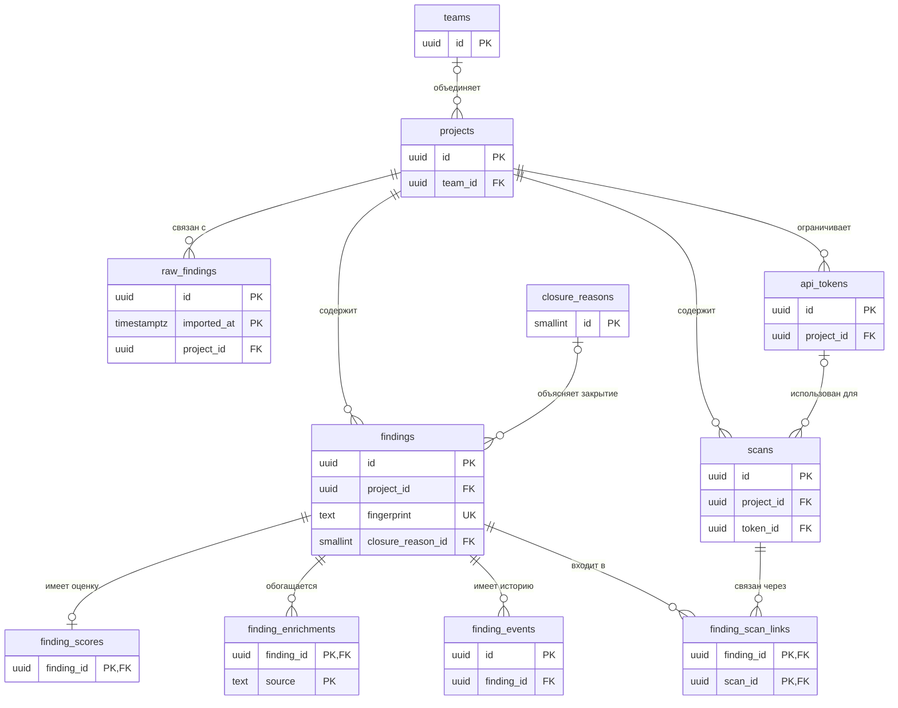
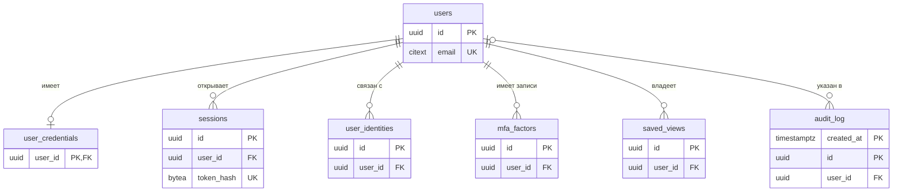
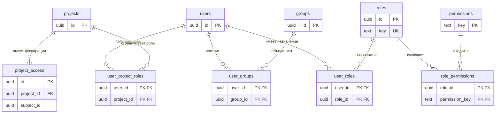

# Система-Схема-базы-данных

Схема описана по совокупности SQL-миграций, включая последующие изменения исходных таблиц. Наличие таблицы или поля не означает, что соответствующая возможность используется работающим приложением. В частности, `raw_findings`, каталог разрешений и таблицы факторов MFA нельзя трактовать как гарантии сохранения отчётов, динамического RBAC или многофакторного входа.

## Основные сущности

| Таблица | Ключ и назначение | Существенные поля и связи |
|---|---|---|
| `projects` | UUID `id`; проекты, уникальные `name` и `slug` | Репозиторий, теги, статус, видимость, SLA, `team_id`, `created_by`; `source_kind`, `default_branch`, `autoscan_on_push` — параметры источника, не исполнитель сканера |
| `teams` | UUID `id`; команды проектов | Имя, описание; не равнозначны группам доступа `groups` |
| `findings` | UUID `id`; нормализованные находки; глобально уникальный `fingerprint` | Обязательный `project_id`; severity, confidence, status; CVE/CWE-массивы, пути, строки, компонент и версия; данные категории; назначение и закрытие |
| `raw_findings` | Составной PK `(id, imported_at)`; структура для сырых данных | `raw_data` JSONB, источник, fingerprint, обязательный проект; штатные обработчики импорта сюда не записывают |
| `finding_enrichments` | PK `(finding_id, source)`; снимки обогащения | JSONB `data`, `enriched_at`; FK на находку с `ON DELETE CASCADE` |
| `finding_scores` | PK `finding_id`; текущие вычисленные оценки | CVSS, EPSS, percentile, признаки KEV/БДУ, `priority_score`, `calculated_at`; FK на находку с каскадным удалением |
| `closure_reasons` | `SMALLSERIAL id`, уникальный `code`; причины закрытия | Целевой статус, обязательность пояснения, активность |
| `finding_events` | UUID `id`; события и комментарии | `finding_id` с каскадным удалением; `user_id` с `SET NULL`; тип, JSONB payload, время |
| `api_tokens` | UUID `id`; проектные PAT | Хеш секрета, prefix, scopes, создатель, срок и отзыв; проект удаляет токены каскадно |
| `scans` | UUID `id`; метаданные принятых CI-отчётов | Проект, commit, ветка, сканер, статус, счётчики; ссылки на токен и инициатора допускают `NULL`; содержимого файла нет |
| `finding_scan_links` | PK `(finding_id, scan_id)`; связь находок и сканов | `is_new`; оба FK с каскадным удалением; равенство проектов находки и скана не проверяется |

Дополнения `findings` охватывают `finding_kind`, `fixed_version`, `package_ecosystem`, `purl`, `code_snippet`, `code_flow`, `url`, `http_method`, `http_param`, `http_evidence`, `iac_resource`, `iac_provider`, `secret_kind`, `commit_sha`, `rule_id`, `rule_name`, `secret_fingerprint`. Поля триажа — `closure_reason_id`, `closure_note`, `closed_at`, `closed_by`, `assigned_to`.

### Связи находок

На диаграммах показаны основные физические FK. Вспомогательные ссылки на создателя, автора и назначенного пользователя описаны в таблицах и не дублируются на каждой схеме. `o|` означает необязательную единственную запись, `o{` — от нуля до многих.

## Локальные справочники

| Таблица | Ключ | Назначение |
|---|---|---|
| `nvd_cves` | `cve_id` | Описание, CVSS v2/v3.1/v4.0, CWE, CPE-сопоставления, ссылки, даты и сырые данные NVD |
| `epss_scores` | `cve_id` | Текущие EPSS, percentile и дата набора |
| `epss_history` | `(cve_id, score_date)` | История EPSS; партиционирована по дате |
| `kev_catalog` | `cve_id` | KEV, дата включения, срок, ransomware, описание и требуемое действие |
| `bdu_fstec` | `bdu_id` | БДУ, CVE/CWE, CVSS v2/v3/v4, статусы, ПО, окружение, источники и сырые данные |
| `osv_vulnerabilities` | `osv_id` | OSV, aliases, экосистема и пакет, диапазоны, severity, ссылки и даты |
| `cwe_catalog` | `cwe_id` | CWE, родители, описания, последствия и меры |
| `cpe_dictionary` | `cpe_uri` | CPE, производитель, продукт, версия, признак устаревания |
| `sync_status` | `source` | Состояние синхронизации, отметка времени, количество записей, ошибка и длительность |

Между справочниками и массивами `findings.cve_ids`/`cwe_ids` нет FK. Сопоставление выполняет код обогащения. Это позволяет принять находку до загрузки соответствующего справочника. Поле `finding_enrichments.source` также не является FK на `sync_status`.

## Пользователи, доступ и аудит

| Таблица | Ключ и назначение | Существенные ограничения |
|---|---|---|
| `users` | UUID `id`; локальные пользователи | Email `CITEXT UNIQUE`; `password_hash`, `is_active`, `global_role`, `status`, системный признак и автор создания |
| `user_credentials` | PK/FK `user_id`; дополнительные данные пароля | `must_change`, причина, дата пароля, failed attempts, locked until; эти поля не все участвуют в входе |
| `sessions` | UUID `id`; серверные сессии | FK пользователя с каскадным удалением; уникальный хеш токена, срок, отзыв и причина отзыва, IP, User-Agent |
| `user_identities` | UUID `id`; записи идентичностей | FK пользователя; уникальность `(user_id, kind, provider_id)`; допустимые local/ldap/ad/oidc не доказывают реализацию этих способов входа |
| `mfa_factors` | UUID `id`; записи факторов | FK пользователя; kind, метка и даты; проверка фактора при входе не реализована |
| `saved_views` | UUID `id`; сохранённые представления пользователя | FK пользователя с каскадным удалением; имя и JSONB query |
| `user_project_roles` | PK `(user_id, project_id)`; действующие проектные роли | Оба FK с каскадным удалением; role, дата, выдавший пользователь |
| `roles` | UUID `id`, уникальный `key`; каталог ролей | Имя, описание и системный признак |
| `permissions` | Текстовый PK `key`; каталог разрешений | Ресурс, действие, описание |
| `role_permissions` | PK `(role_id, permission_key)` | FK на каталоги с каскадным удалением |
| `user_roles` | PK `(user_id, role_id)` | FK с каскадным удалением, дата и выдавший пользователь |
| `groups` | UUID `id`; группы доступа | Уникальное имя, дополнительно уникальный индекс `lower(name)`; manual/ldap_sync, внешний ID |
| `user_groups` | PK `(user_id, group_id)` | Членство; оба FK с каскадным удалением |
| `project_access` | UUID `id`; декларации доступа user/group | Уникальность `(project_id, subject_kind, subject_id)`; уровни read/write/admin; проект с каскадным удалением |
| `audit_log` | PK `(created_at, id)`; события аудита | Партиционирование по времени; `user_id` с `SET NULL`; запрос, ресурс, статус, риск, changes и поля integrity |

### Учётные записи

### Назначения доступа

`project_access.subject_id` — полиморфная ссылка без FK. Триггер проверяет существование пользователя или группы при вставке/смене субъекта. Это не каскадная связь при удалении субъекта, поэтому стрелка FK к users/groups на схеме отсутствует.

Миграция групп однократно переносит назначения из `user_project_roles` в `project_access`; автоматическая двусторонняя синхронизация этих таблиц не реализована. Фактический `RequireProjectRole` продолжает читать `user_project_roles`, не объединяя прямой и групповой доступ из `project_access`.

Отдельные триггеры согласуют `users.global_role` и назначение роли `admin` в `user_roles`. Каталог `role_permissions` не используется как универсальный движок проверки каждого запроса. Триггер обновления `users.password_hash` синхронизирует хеш с `user_credentials`, но не заменяет создание credential-записи при первоначальном создании пользователя.

## Партиционирование

| Таблица | Ключ RANGE и PK | Создание и обслуживание |
|---|---|---|
| `raw_findings` | `imported_at`; PK `(id, imported_at)` | В миграции заданы месяцы с апреля 2026 по март 2027, верхняя граница последней партиции — `2027-04-01`; автоматического продления в сервере нет |
| `audit_log` | `created_at`; PK `(created_at, id)` | Миграция создаёт текущий месяц и три следующих. Сервер при старте и каждые 24 часа вызывает `EnsurePartition` для текущей даты UTC и даты `now.AddDate(0, 1, 0)` |
| `epss_history` | `score_date`; PK `(cve_id, score_date)` | Статические месяцы с апреля по сентябрь 2026, верхняя граница — `2026-10-01`; автоматического продления в синхронизаторе нет |

Даты в таблице — буквальные границы SQL, а не скользящее обещание покрытия будущих периодов. В миграциях нет default-партиций. Вставка даты вне существующих диапазонов завершается ошибкой. Запись текущих EPSS и истории выполняется в одной транзакции: отсутствие партиции истории откатывает и обновление `epss_scores`.

`EnsurePartition` приводит переданную дату к первому числу месяца UTC. Однако `AddDate` вызывается до этого приведения: в конце длинного месяца дата «через месяц» может нормализоваться уже в следующий за ним месяц. Нельзя считать этот вызов безусловной проверкой именно ближайшего календарного месяца.

Ошибка обеспечения партиции аудита приводит к завершению процесса сервера. Для `raw_findings` и `epss_history` аналогичного фонового обслуживания нет. Автоматическое удаление старых партиций этих таблиц и `audit_log` не реализовано; упоминание retention в SQL-комментарии не является исполняемой политикой хранения.

Таблица `findings` не партиционирована. Отделение `raw_findings` само по себе не ускоряет запросы списка нормализованных находок.

## Стратегия индексов

| Группа | Реализованные индексы | Назначение и границы |
|---|---|---|
| Идентичность | PK и UNIQUE, в том числе глобальный fingerprint, email, slug, составные ключи связей | Ограничивают дубли на уровне БД; отдельный неуникальный индекс fingerprint существует дополнительно |
| Хронология находок | BRIN по `first_seen`; B-tree `(first_seen DESC, id DESC)` и `(project_id, first_seen DESC, id DESC)` | BRIN охватывает диапазоны времени; составные B-tree соответствуют курсору по времени и ID |
| Поиск | GIN `findings.cve_ids`, GIN `search_vector` | `@>` по CVE и полнотекстовый поиск; `search_vector` хранится вычисленно из названия, описания и компонента с конфигурацией `english` |
| Фильтры находок | B-tree project, severity, status, source, kind; составные kind/status/project и kind/project | Поддерживают частые сочетания фильтров; отдельного GIN для `findings.cwe_ids` в миграциях нет |
| Частичные индексы | Открытые critical, назначенные открытые, ненулевые ecosystem/IaC/secret, наличие CVE или исправления, ненулевой secret fingerprint | Индексируют подмножество; использование зависит от соответствия предикату запроса |
| Оценки | `finding_scores(priority_score DESC)` | Доступ к приоритетам; не устраняет стоимость соединения и иных фильтров |
| Справочники | GIN NVD CWE, БДУ CVE/ПО, OSV aliases; B-tree экосистема/пакет, CPE vendor/product, даты NVD/KEV | Соответствуют поиску обогащения по идентификаторам и атрибутам |
| История и сканы | Находка/время события, пользователь/время; проект/время скана, проект/ветка/commit; CVE/дата EPSS | Получение связанных и хронологических данных |
| Аудит | Время/ID, пользователь, ресурс, trace, session, риск, HTTP-статус и метод | Фильтрация журнала; на партиционированной таблице индексы относятся к её партициям |
| Доступ и сессии | Составные индексы назначений; уникальный хеш сессии; частичные индексы неотозванных сессий и токенов | Поиск доступа и активных записей; индекс prefix PAT не уникален |

Уникальный частичный индекс `finding_events` ограничивает `seen_again` одной записью на находку и сутки UTC. Это ограничение истории, а не ограничение увеличения `times_seen`.

Индексы не гарантируют конкретный план выполнения. Их цена — дополнительный объём и работа при вставке/обновлении. Особенности текущих запросов приведены в [производительности](Система-Производительность).

## Оценки и materialized views

| Объект | Тип | Содержимое и использование |
|---|---|---|
| `finding_scores` | Таблица | Результат вычисления в Go; обновляется UPSERT по `finding_id` при обогащении |
| `dashboard_stats` | Materialized view | Группы project/severity/status: количество, новые за неделю, средний priority; уникальный индекс по тройке. Текущий `DashboardRepo.GetStats` основные счётчики читает напрямую из `findings`, не из этого представления |
| `enrichment_coverage` | Materialized view | Число обогащённых находок по источнику и общее количество; уникальный индекс по source. Используется для глобального покрытия; при проектном ограничении покрытие считается прямым запросом |

`StartMatViewRefresher` каждые пять минут последовательно выполняет `REFRESH MATERIALIZED VIEW CONCURRENTLY` для обоих представлений. Немедленного обновления при старте нет; при ошибке пишется лог и обработка продолжается. Уникальные индексы определены миграцией специально для идентификации строк представлений.

Среднее значение в `dashboard_stats` агрегирует уже сохранённые оценки; оно не рассчитывает priority каждой находки. Обновление представлений не исправляет устаревшие `finding_scores`. Глобальный дашборд дополнительно кэшируется в Redis, поэтому актуальность его полей может различаться.

## Миграции и обратимость

Сервер применяет `m.Up()` до запуска HTTP; ошибка, отличная от `ErrNoChange`, останавливает запуск. Каталог содержит прямые и обратные SQL-файлы, но обратная миграция не означает восстановление удалённых данных: многие down-файлы удаляют таблицы или столбцы, а обратная миграция создания актуальных партиций аудита оставлена без действий. Порядок обновления и восстановления описан в [обновлении](Администратор-Обновление) и [восстановлении](Администратор-Восстановление).

## Исходный код

Все определения и последующие изменения сверены с [https://github.com/Nefrit0n/Red-Lycoris/tree/main/backend/migrations](https://github.com/Nefrit0n/Red-Lycoris/tree/main/backend/migrations).

| Проверяемая часть | Источник |
|---|---|
| Обслуживание партиций и миграции | [https://github.com/Nefrit0n/Red-Lycoris/blob/main/backend/cmd/server/main.go](https://github.com/Nefrit0n/Red-Lycoris/blob/main/backend/cmd/server/main.go), [https://github.com/Nefrit0n/Red-Lycoris/blob/main/backend/internal/storage/audit_log_repo.go](https://github.com/Nefrit0n/Red-Lycoris/blob/main/backend/internal/storage/audit_log_repo.go) |
| EPSS и транзакция истории | [https://github.com/Nefrit0n/Red-Lycoris/blob/main/backend/internal/enrichment/epss/sync.go](https://github.com/Nefrit0n/Red-Lycoris/blob/main/backend/internal/enrichment/epss/sync.go) |
| Фактические проектные роли | [https://github.com/Nefrit0n/Red-Lycoris/blob/main/backend/internal/storage/user_project_roles_repo.go](https://github.com/Nefrit0n/Red-Lycoris/blob/main/backend/internal/storage/user_project_roles_repo.go) |
| Обновление представлений | [https://github.com/Nefrit0n/Red-Lycoris/blob/main/backend/internal/storage/matview_refresher.go](https://github.com/Nefrit0n/Red-Lycoris/blob/main/backend/internal/storage/matview_refresher.go) |
| Чтение дашборда | [https://github.com/Nefrit0n/Red-Lycoris/blob/main/backend/internal/storage/dashboard_repo.go](https://github.com/Nefrit0n/Red-Lycoris/blob/main/backend/internal/storage/dashboard_repo.go) |
